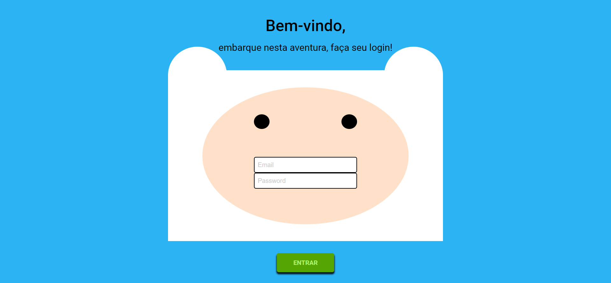

# Finn form

> Status : Finished project ✅ / Open PR

## Challenge [10] Vai na Web M1

*Technologies*

+ ReactJS ⚛️
+ Styled-components 💅

### How to use
 
 - git clone https://github.com/12Gustavo21/Finn-form.git
 - npm install
 - code .
 - npm start
 
 ## 💻 Online Page: https://finn-form.bohr.io

## 🌐 Contact me:
 
